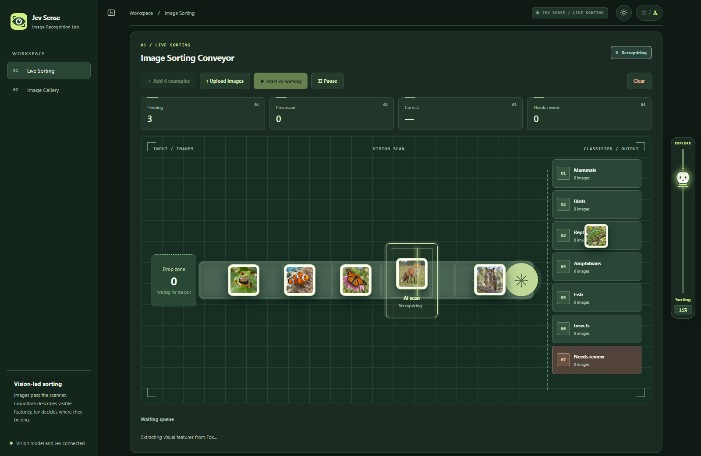
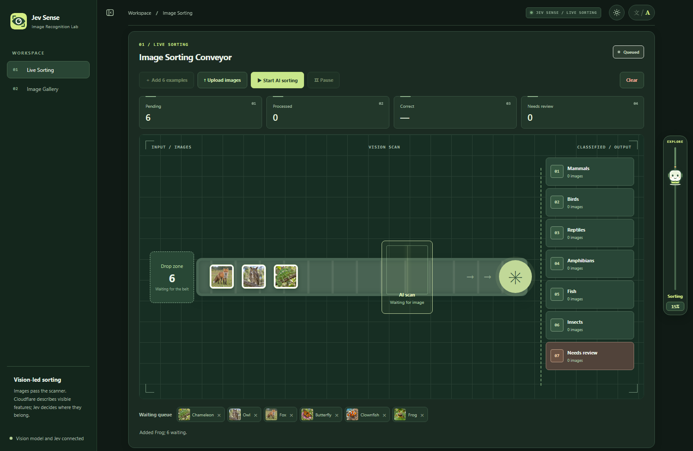
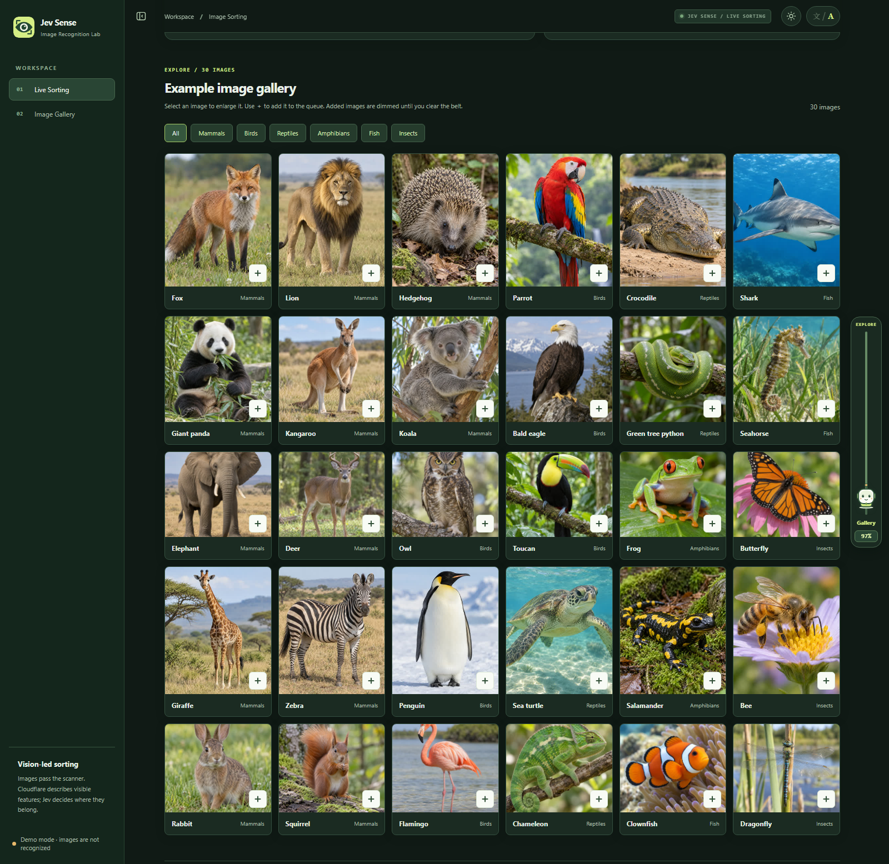
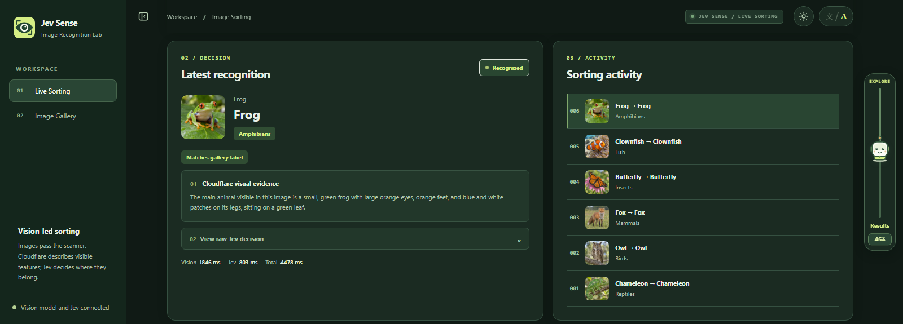

# Jev Sense

English | [Read in Chinese](README.zh-CN.md)

Jev Sense is an interactive demo of image understanding and structured decisions. Cloudflare Workers AI describes visible content; Jev uses that evidence to choose a label, and the UI shows each image moving through scanning, sorting, and review. The current demo uses a 30-image animal gallery and six animal categories. You can upload your own images and inspect the available visual evidence and Jev decisions.

The same workflow could be adapted for adult-content screening, image tagging, and custom classification. These are future applications; the current conveyor UI implements animal sorting.


[Watch six images get sorted (MP4)](docs/demo.mp4) · [Browse the gallery screenshot](docs/gallery.png) · [See recognition details](docs/results.png)

> The video and the queue, conveyor, and results screenshots use live Cloudflare and Jev responses. All six sample images matched their gallery labels in this recording; the video plays at 1.5× speed. The full-page overview and gallery screenshots use mock mode.

## Quick start

Requires Node.js 20 or newer.

```powershell
Copy-Item config.example.json config.json
npm start
```

Open <http://127.0.0.1:8788>. The example configuration enables mock mode, so you can explore the UI without API keys. To classify images with real models, edit `config.json`, set `server.mock` to `false`, and provide your Cloudflare Account ID, Workers AI token, and Jev API key. `config.json` is ignored by Git; keep real credentials there or provide them through environment variables.

For development, run `npm run dev`. Run `npm test` for the server tests.

## How to use it

1. Click a gallery image to preview, zoom, or pan it. Use its **+** button to add it to the queue, or select **Add 6 examples**. An image already in the queue is dimmed and cannot be added twice.
2. Upload multiple PNG, JPEG, or WebP images with **Upload images**, or drop them onto the conveyor. Each source file may be up to 20 MB; uploads larger than 30 KB are compressed below 30 KB before processing. The queue holds up to 20 images.
3. Select **Start AI sorting**. Images enter the belt in order, pass the visual scan, and continue toward the category gate while Jev evaluates the visual description. The gate sends each image to Mammals, Birds, Reptiles, Amphibians, Fish, Insects, or Needs review.
4. Select a category outlet, its thumbnail, or an activity record to inspect a specific image. The detail view shows the visual evidence, Jev's raw response, timings, and the sorting history. Failed recognitions can be retried from Needs review.

**Pause** stops new images after the current item. **Clear** cancels active requests and resets the queue, counters, and category outlets.

### Screenshots

The overview above shows the entire page. The images below capture each section from its heading to its bottom edge.



| Conveyor queue | Image gallery |
| --- | --- |
|  |  |



## Recognition flow

The included gallery images live in `docs/animal/`. Cloudflare Workers AI uses `@cf/meta/llama-4-scout-17b-16e-instruct` to describe visible features. Jev receives the textual evidence and chooses one of the 30 reference labels or `uncertain`; gallery ground-truth labels are used only in the browser for comparison and are not sent with the classification request. An unsupported species, an uncertain decision, a request failure, or mock mode places the image in Needs review.

The general `/v1/judge` endpoint already accepts custom questions, while the conveyor UI and animal endpoints use fixed animal labels. Adapting the project for content moderation or tagging would require scenario-specific visual prompts, labels, decision rules, and validation with human review.

The server assembles the homepage from `public/partials/`. `public/app.js` coordinates the queue and classification pipeline; `gallery.js`, `viewer.js`, `results.js`, and `motion.js` handle the gallery, image preview, results, and conveyor animation.

## Model calls and data flow

In live animal-sorting mode, the local server calls a vision model on Cloudflare Workers AI with the image data. It then sends the model's text description and a classification question to the configured Jev API (OpenCode Zen in the example configuration). The Jev request does not include the image. Mock mode makes no external model calls.

The initial idea was to convert images and text into embeddings and send both vectors to Jev for a decision. The System One API used here has no documented multimodal embedding input for that workflow. This led to the current two-step design: the vision model produces a readable image description, and Jev makes a structured decision from that text.

## Acknowledgments

- Thanks to [jev-visual](https://github.com/hr98w/jev-visual) for inspiring this project.
- Thanks to [Cloudflare Workers AI](https://developers.cloudflare.com/workers-ai/) for its free usage allowance for visual recognition.
- Thanks to [TypeSafe AI](https://docs.typesafe.ai/) for Jev and System One, and [OpenCode Zen](https://opencode.ai/docs/zen/) for offering the limited-time free `jev-1.13-free` endpoint used by the example configuration.

## HTTP endpoints

| Endpoint | Purpose |
| --- | --- |
| `GET /health` | Service readiness and configuration status, without secrets. |
| `GET /v1/gallery` | Thirty sample images and their reference labels. |
| `GET /docs/<id>.jpg` | A sample image from `docs/animal/`. |
| `POST /v1/describe-animal` | Visual description and vision timing. |
| `POST /v1/decide-animal` | Jev decision from visual evidence. |
| `POST /v1/classify-animal` | Combined choice, category, evidence, decision, and timings. |
| `POST /v1/judge` | General visual-evidence and Jev question endpoint. |

By default the server listens only on `127.0.0.1`. The request body limit is 12 MB, and the Base64 image limit is 10 MB.
