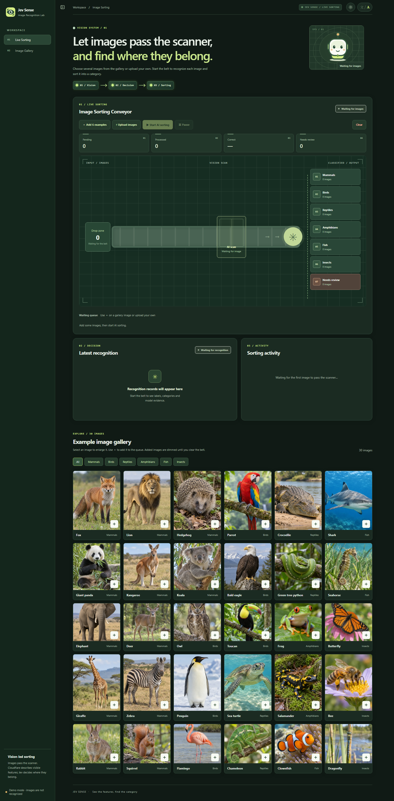

# Jev Sense

[English](README.md) | 简体中文

Jev Sense 是一个展示“图像理解 → 结构化判断 → 分类复核”的交互式项目。Cloudflare Workers AI 描述图片中可见的内容，Jev 根据这些信息选择标签，页面展示图片经过扫描、分拣和复核的过程。当前以动物图片为例，提供 30 张预置图、六类动物出口和多图上传，并可查看已有的视觉线索与 Jev 判定详情。

这套流程后续可用于图像鉴黄（成人内容审核）、图片打标签和自定义分类。当前传送带界面实现的是动物分类，这些用途尚未作为页面功能提供。



[观看 6 张示例图分类演示视频（MP4）](docs/demo.mp4) · [图库截图](docs/gallery.png) · [识别结果截图](docs/results.png)

视频及队列、传送带、结果截图使用真实 Cloudflare 与 Jev 服务录制。本次 6 张示例图均与图库标注一致；视频以 1.5 倍速播放。整页总览和图库截图使用模拟模式。

预置图位于 `docs/animal/`，每张为 384×384 JPEG、不到 30 KB，30 张合计约 700 KB。图片到达扫描点时，浏览器会按最长边不超过 448 px 转为 JPEG，减少请求体积。

## 运行

需要 Node.js 20+。复制 `config.example.json` 为 `config.json` 并填写 Cloudflare Account ID、Workers AI Token、Jev API Key。真实密钥文件已被 `.gitignore` 忽略。

```powershell
Copy-Item config.example.json config.json
npm start
```

打开 <http://127.0.0.1:8788>。修改页面时可使用 `npm run dev`，验证运行 `npm test`。

`server.mock: true` 可用于检查页面与传送带动画，不调用外部 API。模拟模式不会识别图片，所有图片进入“待复核”；要实际分类，将其改为 `false` 并配置有效密钥。

页面结构按功能放在 `public/partials/`，`server.js` 返回首页时组装这些片段。`public/app.js` 负责队列与分类流程；`gallery.js`、`viewer.js`、`results.js`、`motion.js` 分别负责图库、放大预览、结果记录和传送带动画。样式也拆为全局、传送带、结果、图库、预览和响应式文件。

## 使用方式

1. 点击图库图片可放大预览、缩放和拖动；点击图片右下角的“＋”加入队列。已加入的示例图会置灰，无法重复投放；从等待队列移除或清空传送带后可重新加入。也可以一次上传多张 PNG、JPEG、WebP 图片，或将图片拖入传送带区域。单张上传原图上限 20 MB，队列最多 20 张。
2. 点击“启动 AI 分类”。图片依次移动到扫描点；Cloudflare 完成视觉描述后，图片继续沿右侧轨道驶向末端闸口，Jev 同时根据描述判断。到达闸口后等待结果，再进入对应类别箱。每张图片的两次模型请求依次发起。
3. “暂停”会在当前图片完成后停止下一张；“清空”会取消当前请求并重置队列、计数和收集箱。
4. 下方展示识别标签、视觉证据、Jev 原始判定和分拣记录。点击分类出口会选中该类最新一条记录；点击出口缩略图可定位到对应图片，分拣记录和出口缩略图会同步高亮。分类详情仍列出该类的全部记录，可点击任意一条查看。图库标注只在前端用于结果对照，不随分类请求发送。

Cloudflare Workers AI `@cf/meta/llama-4-scout-17b-16e-instruct` 先描述可见动物特征；Jev 根据文字证据，从 30 种预置动物标签或 `uncertain` 中选择。未能确定、请求失败或模拟模式的图片进入“待复核”。上传图片中的其他物种可能无法匹配预置标签。

通用 `/v1/judge` 接口已支持自定义问题，但传送带界面和动物专用接口仍使用固定动物标签。用于内容审核或打标签时，需要针对场景重新设计视觉提示词、标签和判定规则，并验证效果、安排人工复核。

## 模型调用与数据流

真实动物分类模式下，本地服务调用 Cloudflare Workers AI 提供的视觉模型分析图片，请求中包含图片数据；随后把模型返回的文字描述和分类问题提交给配置的 Jev 接口（示例配置使用 OpenCode Zen）。Jev 请求不包含图片。模拟模式不会调用外部模型。

最初的设想是把图片和文字分别转成向量，再将两组向量交给 Jev 判断。当前使用的 System One 接口没有为这种流程提供文档化的多模态向量输入方式，因此改为让视觉模型先生成可读的图片描述，再由 Jev 根据文字做结构化判定。

## 致谢

- 感谢 [jev-visual](https://github.com/hr98w/jev-visual) 为本项目提供思路。
- 感谢 [Cloudflare Workers AI](https://developers.cloudflare.com/workers-ai/) 为视觉识别提供免费额度。
- 感谢 [TypeSafe AI](https://docs.typesafe.ai/) 开发 Jev 和 System One，以及 [OpenCode Zen](https://opencode.ai/docs/zen/) 提供示例配置所用的限时免费 `jev-1.13-free` 接口。

## 接口

- `GET /health`：服务配置状态，不包含密钥。
- `GET /v1/gallery`：30 张预置图及参考标签。
- `GET /docs/<id>.jpg`：预置图片。
- `POST /v1/describe-animal`：请求图片，返回视觉描述与视觉耗时。
- `POST /v1/decide-animal`：请求 `{ "evidence": { "summary": "..." } }`，返回 Jev 标签、类别与判断耗时。
- `POST /v1/classify-animal`：请求 `{ "image": "data:image/jpeg;base64,..." }`，返回 `choice`、`category`、`evidence`、`decision`、`metrics`。
- `POST /v1/judge`：保留的通用视觉证据与 Jev 问答接口。

服务默认只监听 `127.0.0.1`，请求体上限 12 MB，Base64 图片上限 10 MB。

